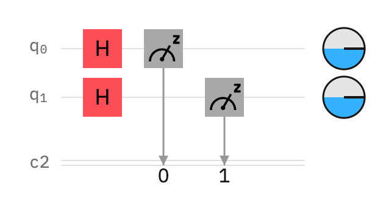
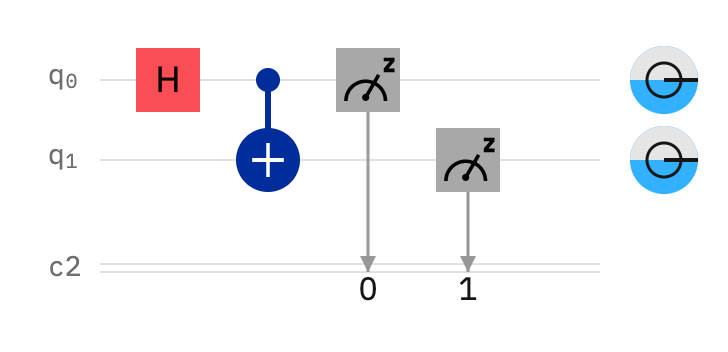

# Solace

This library is a dumping ground for my learning path with AWS Braket. Note that everything here is written by a quantum computing neophyte. So, if you use this code and accidentally break the Universe, please don't blame me.

## Requirements

To run these experiments, you need to have the following requirements satisfied.

#### Python Version 
You must have Python 3.7.2 or greater installed on your machine.

#### Python Packages
In your virtual environment, you need to have both `boto3` and the `amazon-braket-sdk` pip installed into your virtual environment. The specific versions of these libraries last validated to work with this code are captured in the `requirements.txt` file, and can be done with the following command:

```
pip install -r requirements.txt
```

#### IAM Credentials
Next, you will need IAM credentials to an AWS account that has access to both Braket and S3. This can be supplied via environment variables, EC2 instance profile, or a profile file created by `aws configure`.

#### S3 Bucket
The result of your experiments will be saved into an S3 bucket in your account named as follows, where `{aws_account_id}` is your 12 digit account number:

`amazon-braket-output-{aws_account_id}`

Before running any experiments, create a bucket in your account, making sure the IAM credentials you are using will have write-access to the S3 bucket.

This repository contains a helper module - `initialize.py` - that will create the bucket for you (if it does not exists).

```
./initialize.py
```

## Experiments

For each experiment in this repository, the experiment is bundled into a single module. To run the experiment, run the Python module and select the quantum device or simulator you wish to run your experiment on. Results will be displayed to the console (once completed), and stored in the S3 bucket.

If you run an experiment on a device during a timeframe it is not available, it will be queued to run when the device is next online.

## Experiment 1 - Coin Flip 

The first quantum circuit we will create is a simple coin flip. To understand this experiment, you first should look at it from a traditional compute. You can doing this in a physical way using two coins. Take two coins and flip them both 20 times, counting the results.

My own experiment resulted in the following result table, with the coin values represented as a two-bit binary number having tails as 0 and heads as 1.

|Result|Count|Percentage|
|--|--|--|
|00|5|25%|
|01|5|25%|
|10|4|20%|
|11|6|30%|

The more times you flip the coins, each percentage should approach 25%.

For traditional computing, we would accomplish this by generating a pseudo-random number. The experiment file `pseudorandom.py` run the coin flip simulation 100 times.

Running this, I generated the following results...

|Result|Percentage|
|--|--|
|00|28%|
|01|26%|
|10|24%|
|11|22%|

To move from traditional compute to quantum, we will create a quantum circuit for this problem. In a quantum circuit, you are still dealing with two "coins" - in this case qubits. We "flip" the coin in a quantum circuit using a Hadamard gate (or H gate). The H gate puts a qubit into a superposition. In a superposition, a qubit has an equal probability of being both a 0 and 1, but it is *both* until measured.

Further reading for H gates and quantum superposition is available here:

* https://en.wikipedia.org/wiki/Quantum_logic_gate#Hadamard_(H)_gate

* https://en.wikipedia.org/wiki/Quantum_superposition

The circuit for the coin flip experiment looks like this...



To run this experiment, run the `coin_flip.py` experiment in your virtual environment. This will run 100 shots of the quantum circuit on your selected device.

A set of experiment results from the AWS simulator for this circuit came back with the following result:

|Result|Percentage|
|--|--|
|00|25%|
|01|30%|
|10|27%|
|11|18%|

The AWS simulator is using high-entropy pseudo-random number to simulate quantum behavior. However, when we move to an actual quantum device, the numbers become truly random.

Running the same computation on the Rigetti Aspen-9 quantum computer yielded the following results.

|Result|Percentage|
|--|--|
|00|29%|
|01|22%|
|10|24%|
|11|25%|

What is happening in this experiment is that we are observing the state of the two qubits in our circuit. By observing bits, we are collapsing the quantum wave state and getting either a 0 or 1, with an equal probability of each. Since we have two qubits in a superposition without any entanglement, we see that the probabilities of each outcome approaches the same probabilities yielded by traditional computing with pseudo-random number generation. 

From this experiment, we can see the probabilistic behavior of qubits in superposition. However, to really appreciate what is going on, we need to move to our second experiment.

## Experiment 2 - Quantum Teleportation

To see the power of quantum, we are going to take this experiment a step further. Rather than flipping both "coins", we are going to take advantage of quantum entanglement to flip one coin and have *both* coins flip to the same value. This circuit - called a Bell state circuit - is the 'hello world' of quantum computing. It is a quantum circuit where two qubits are maximally entangled. It demonstrates the concept of *quantum teleportation*. (Yes, 'hello world' for quantum involves teleportation!)

Quantum teleportation, or "spooky action at a distance" as referred to by Einstein, is the quantum property that allows quantum state to be "teleported" between entangled qubits in superposition by observing one qubit and having the same value exist on the second qubit. This experiment will show you how to build a circuit that teleports a random number from one qubit to a second qubit.

We will do this using a controlled NOT (or CNOT) gate. A CNOT gate will entangle two qubits, so that when one qubit in superposition is observed, *both* qubits in the entanglement have their superposition collapsed to the same value. The entanglement is called a Bell state.

Further reading on QNOT, entanglement, and Bell states is available here:

* https://en.wikipedia.org/wiki/Controlled_NOT_gate

* https://en.wikipedia.org/wiki/Quantum_entanglement

* https://en.wikipedia.org/wiki/Bell_state

* https://en.wikipedia.org/wiki/Quantum_teleportation

In additionm, a great lecture by Umesh V. Vazirani from University of California, Berkeley on quantum teleportation and Bell state is available here:

* https://www.youtube.com/watch?v=tMoHhqERK9I

For this experiment, we are creating a quantum circuit where we put the first qubit in a superposition using an H gate and then entangle the two bit into a Bell state using a CNOT gate. Finally, we observe the two states.

The circuit for this experiment is seen here:



To run this experiment, run the `teleportation.py` experiment in your virtual environment. This will run 100 shots of the quantum circuit on your selected device.

If this was traditional compute, we would expect to see variability in the first qubit, but our second qubit would remain a zero. However, due to the quantum behavior of entanglement, we see a high probability of the second entangled qubit exhibiting the same behavior as the first qubit. This circuit is akin to having two coins. You "flip" one of the coins, and the entanglement "flips" the other coin.

A set of experiment results from the AWS simulator for this circuit came back with the following result:

|Result|Percentage|
|--|--|
|00|45%|
|11|55%|

You can see here that the simulator resulted in perfect entanglement, with no outcomes of 01 or 10. This is because the simulator is designed to simulate perfect quantum computing behavior. Actual quantum devices - which use actual entanglement - are susceptible to "noise" that can break entanglement.

Running the same computation on the Rigetti Aspen-9 quantum computer yielded the following results.

|Result|Percentage|
|--|--|
|00|35%|
|01|11%|
|10|13%|
|11|41%|

We see that there is a significant amount of "noise" in this experiment. This noise is due to the imperfections and issues with current state quantum computers. As quantum computers advance, we should see this noise move much closer to zero. However, even given the noise, we see that the actual values are proportionally aligned.

Running on the IonQ quantum computer, we get numbers that are much closer to the simulated values.

|Result|Percentage|
|--|--|
|00|55%|
|01|12%|
|11|43%|

To understand why the IonQ gets better answers, we need to look at the physics and topology of the two quantum computers. The IonQ QPU is using trapped ions in an all-to-all topography. This computer allows for better entanglement, but is more expensive to run and limited to 11 qubits. The Rigetti Aspen-8 QPU uses superconducting qubits in an octagonal pattern with nearest-neighbor entanglement. This allows for many more qubits, currently limited to 30. But, this comes at a cost of entanglement quality.

As QPUs continue to evolve, we should see different topologies emerge as "best fit" for different quantum computation workloads, and the overall stability of the systems should improve drastically.